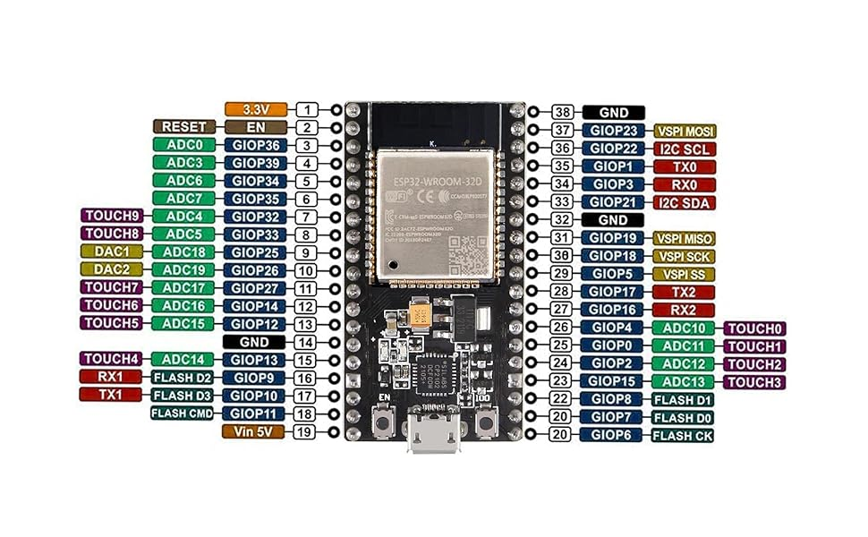

# UWF Capstone: Smart Solar Water Heater
Program for smart system

## [MATTER Docs](https://docs.espressif.com/projects/esp-matter/en/latest/esp32/index.html)

## [ESP32 API Docs](https://docs.espressif.com/projects/esp-idf/en/stable/esp32/api-reference/index.html)

## Pinout
### ESP32

#### Used Pins
- 4 [IN]: Temp Sensor OneWire Data
- 6 [IN]: Inclinometer
- 30 (GIOP 18) [OUT]: Pump Relay
- 28 (GIOP 17) [OUT]: Arm Enable
- 26 (GIOP 04) [OUT]: Arm Extend
- 27 (GIOP 16) [OUT]: Arm Retract
- 33 (GIOP 21) [OUT]: Gyro SDA
- 36 (GIOP 22) [OUT]: Gyro SCL

### Temp Sensor
- Red: VCC
- Black - GND
- Yellow - Data
- Pullup Resistor - 4.7k ohm Data/VCC

### H-Bridge Motor Driver - Linear Actuator "Arm"
- ENA: Enable motor
- IN1: Direction 1
- IN2: Direction 2

### Gyroscope - MPU6050
- SCL: Serial Clock
- SDA: Serial Data
- XDA: Aux Data (UNUSED)
- XCL: Aux Clock (UNUSED)
- AD0: Address select (May need to GND if address problems)
- INT: Interrupt to other dev (UNUSED)

## Adruino IDE Setup

Preferences > Additional boards manager URLs:
 - `https://dl.espressif.com/dl/package_esp32_index.json`

Boards Manager
 -  **esp32** by Espressif Systems `3.3.6`

Library Manager
 - **esp32-ds18b20** by junkfix `2.0.3`
 - **Adafruit MPU6050** by Adafruit `2.2.9` and dependencies

Select Board **ESP32 Dev Module**

## Solar Noon
 - [NOAA Solar Calculator](https://gml.noaa.gov/grad/solcalc/)
 - [NOAA Solar Tables for Pensacola 2024](https://gml.noaa.gov/grad/solcalc/table.php?lat=30.529145&lon=-87.220458&year=2024)
 
 #### Importing Solar Noon Data
 
 1. Select a location and year in the [NOAA Solar Calculator](https://gml.noaa.gov/grad/solcalc/) and click the *Create Sunrise/Sunset Tables for the Year* button
 2. Copy the entire Solar Noon table and **paste unformatted** to a spreadsheet, remove headers and rearrange data into the first column in order
 3. Remove the DST Offset from around day 70 to around day 310.
	- Libreoffice Calc: Format as time, type 1:00:00 into a blank cell, copy it, select the DST range, Paste Special, Operations: Subtract, OK
 3. Save as a .csv file in SolarNoon folder
 4. Edit `SolarNoonHeaderMaker.py` and update `SOURCE_CSV_FILENAME` if changed from default `"SolarNoon_2024.csv"`
 5. Execute the python script with `python3 SolarNoonHeaderMaker.py` while in the SolarNoon folder to build `solar_noon.h`

## TODO
 - [ ] Read sensors
 - - [x] Read temp sensors: [esp32-ds18b20 Library](https://github.com/DavidAntliff/esp32-ds18b20?tab=readme-ov-file)
 - - [ ] Read Incline sensor: []
 - [ ] Start matter connection
 - [ ] Send sensor data to matter server
 - [ ] Pump on timer and/or sensor control
 - [ ] Tracking Acutator 15 deg/hr based on solar noon array
 - - [ ] need local time somehow (WiFi? Builtin?)
 - - [ ] use inclinometer / gyroscope for actual angle
